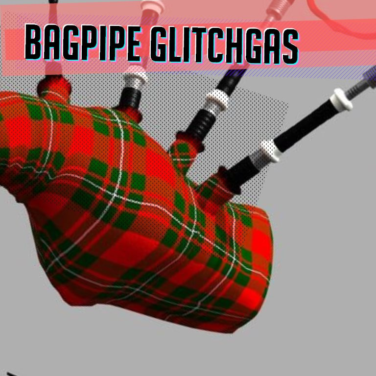
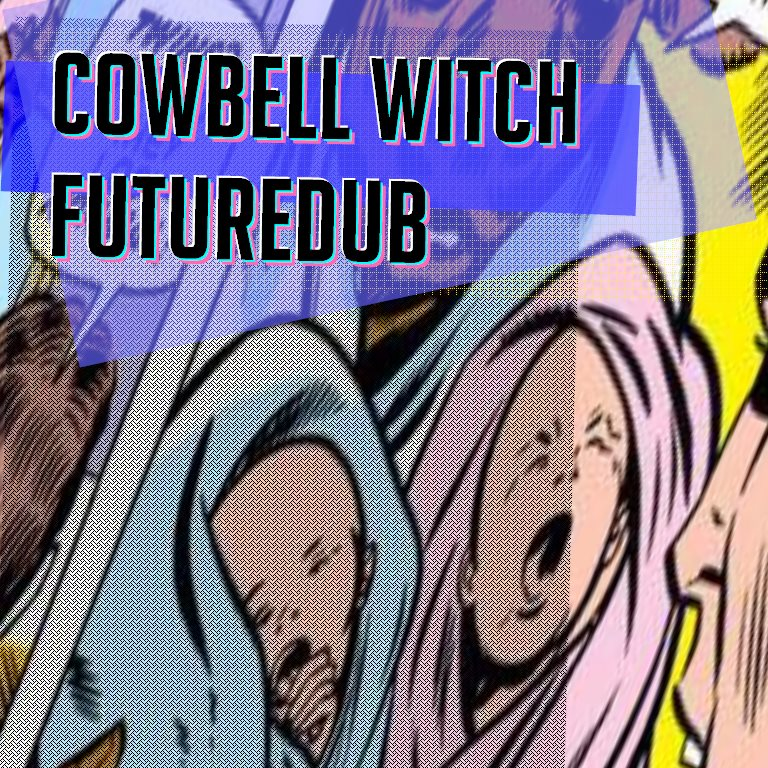
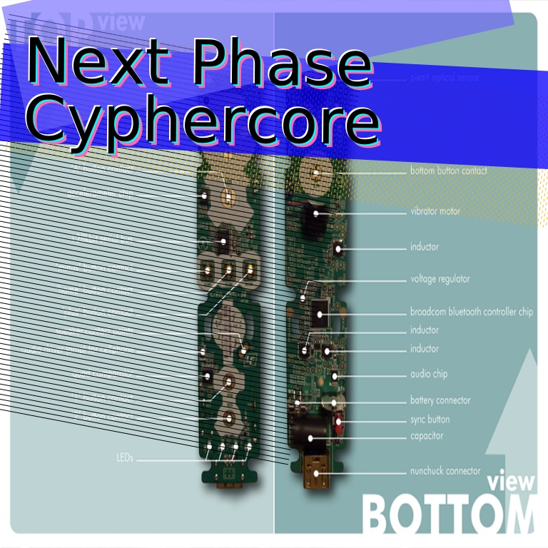
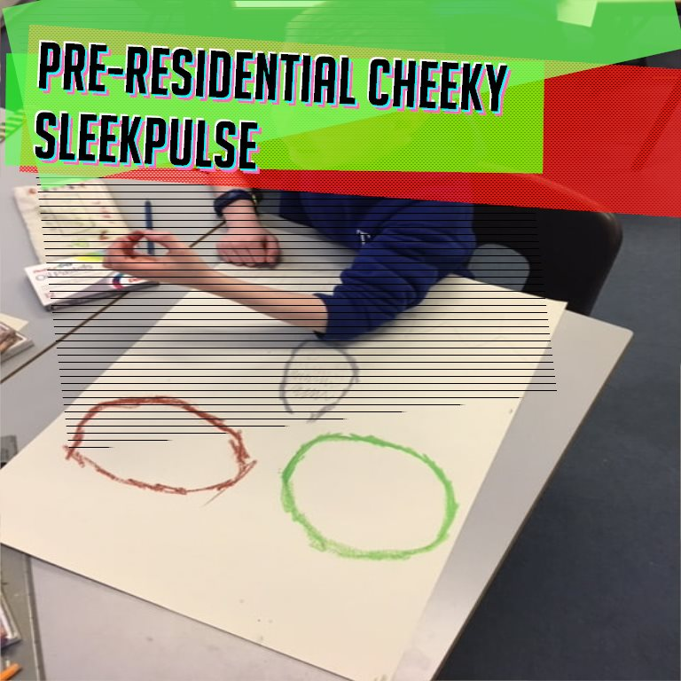
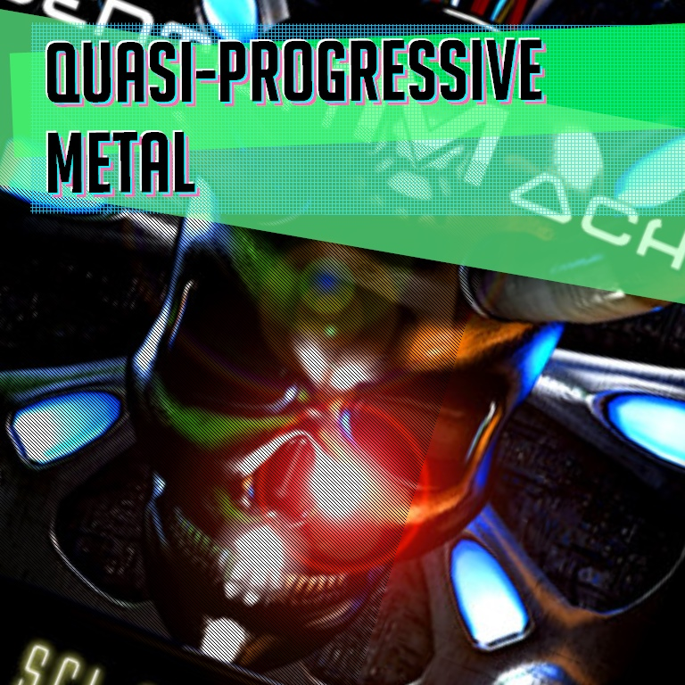
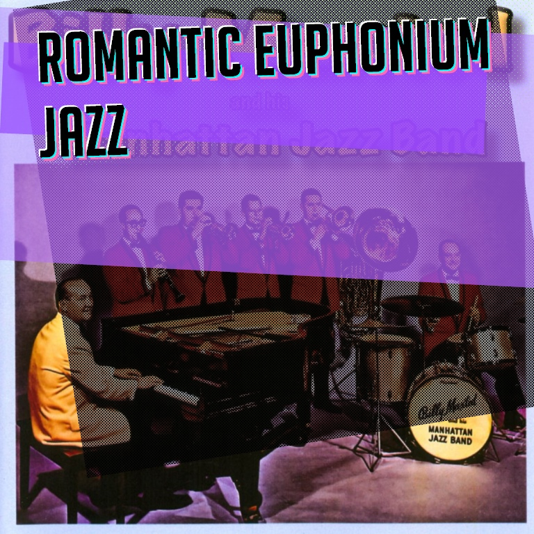

# eNME

Oh, you're into *Post-Transactional Arctic Mathtrap*? That shit is so 2021

 

 

### Sorry What

A dopey Discord "bot" that can generate new music genres procedurally and blop them into a discord channel either on-demand or as a cron job to delight and upset.

It pulls images from Bing to use as a background and makes little swatches to present the new genre.

It's not very fancy, it was built to just work for our use. 

 

 

### Behold

